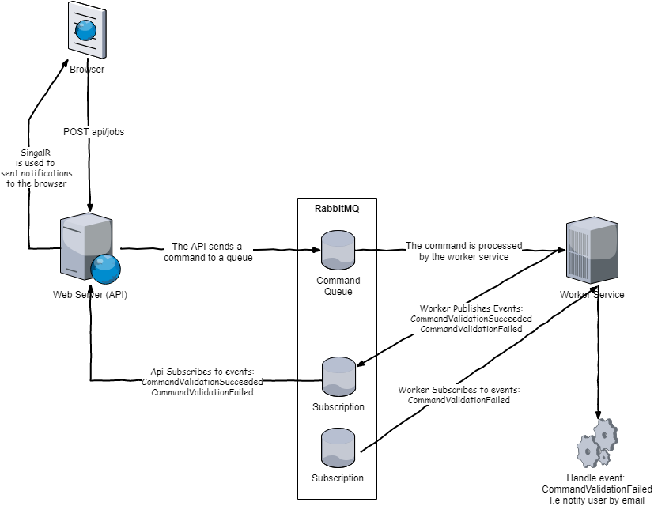

```gherkin
As a developer

I want to show you a simple publish/subscribe solution 
demonstrating how asynchronous command validation and 
execution could be implemented

So that you think I'm awesome
```





Requirements:
* [Visual Studio 2017](https://visualstudio.microsoft.com/downloads/)
* [RabbitMQ on localhost](https://www.rabbitmq.com/download.html)

[](https://ci.appveyor.com/project/henrikbecker/async-validation/branch/master)

